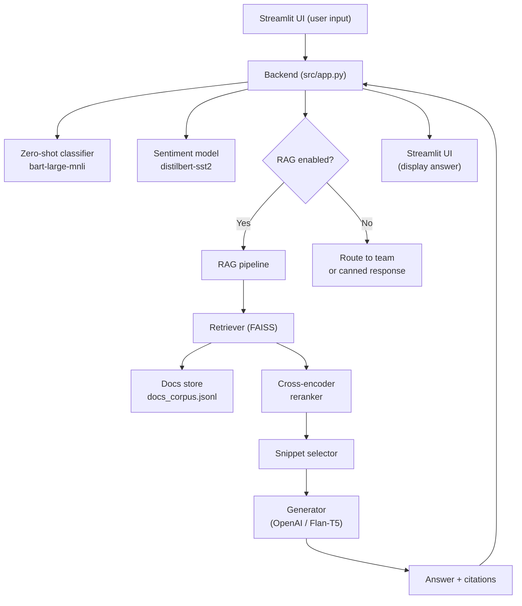

# Customer Support Copilot

An AI-powered assistant for classifying customer support tickets, analyzing intent and sentiment, assigning priority, and providing retrieval-augmented generation (RAG) answers from Atlan documentation — all in an interactive Streamlit UI.

This project was developed as part of Atlan’s AI Copilot assignment and demonstrates an end-to-end pipeline that integrates zero-shot classification, sentiment analysis, priority inference, and RAG-powered answers.

- Live UI built with [Streamlit](https://streamlit.io)
- Zero-shot topic classification with [facebook/bart-large-mnli](https://huggingface.co/facebook/bart-large-mnli)
- Sentiment with [distilbert-base-uncased-finetuned-sst-2-english](https://huggingface.co/distilbert-base-uncased-finetuned-sst-2-english)
- Embeddings with [sentence-transformers/all-MiniLM-L6-v2](https://huggingface.co/sentence-transformers/all-MiniLM-L6-v2)
- Vector search with [FAISS](https://github.com/facebookresearch/faiss)

---

## ✨ Features

- Bulk Ticket Classification Dashboard
  - Zero-shot classification of tickets into Atlan-relevant categories using `facebook/bart-large-mnli`.
  - Sentiment analysis using `distilbert-base-uncased-finetuned-sst-2-english`.
  - Priority assignment via readable, rule-based heuristics.
  - Filter, search, and interactively explore classified tickets.

- Interactive Agent UI
  - Paste or type a ticket and view backend classification (topic, sentiment, priority).
  - If classified into supported categories (How-to, Product, Best practices, API/SDK, SSO), the agent triggers RAG over Atlan documentation.
  - Answers include citations and top retrieved passages for transparency and debugging.

- Retrieval-Augmented Generation (RAG)
  - Documentation scraped from [docs.atlan.com](https://docs.atlan.com) and [developer.atlan.com](https://developer.atlan.com).
  - Cleaned, chunked, embedded with Sentence Transformers, and indexed with FAISS.
  - Lightweight reranker filters noisy chunks before answer generation.

- Deployment
  - Runs locally with Streamlit.
  - Reproducible container via Dockerfile.
  - Optional hosting on Hugging Face Spaces for a live demo.

---

## 🏗️ Architecture

Note: GitHub renders Mermaid diagrams in Markdown files. If you’re previewing this README somewhere that doesn’t support Mermaid (e.g., some IDE previews, PyPI, Streamlit Markdown), use the ASCII fallback below.



<details>
<summary>ASCII fallback (expand if Mermaid does not render)</summary>

```
[Sample Tickets]
        |
        v
 [Data Loader]
     /     \
    v       v
[Zero-Shot] [Sentiment]
  (BART)      (SST-2)
     \         /
      v       v
     [Priority Rules]
            |
            v
 [Classification Dashboard]  ---> (Interactive Analysis) ---> [RAG Pipeline]

RAG Pipeline:
[User Query/Ticket]
        |
        v
 [Embedding (ST/all-MiniLM-L6-v2)]
        |
        v
   [FAISS Retrieval]
        |
        v
 [Reranker (Cross-Encoder)]
        |
        v
 [Generator (LLM/OpenAI)]
        |
        v
 [Answer + Sources]
```
</details>

Tickets flow through the classification pipeline and optionally into the RAG module for cited answers.

---

## 🔑 Major Design Decisions & Trade-offs

- Zero-Shot vs Fine-Tuned Classifier
  - Chosen: `facebook/bart-large-mnli` to avoid fine-tuning overhead.
  - Trade-off: Faster development and decent accuracy vs potentially higher accuracy with domain-tuned models.

- Rule-based Priority Assignment
  - Simple, interpretable keyword and sentiment-driven rules (P0, P1, P2).
  - Trade-off: Easy to maintain vs less nuanced than ML-based approaches.

- RAG with Local FAISS Index
  - `all-MiniLM-L6-v2` embeddings stored in FAISS for fast retrieval.
  - Trade-off: Lightweight and efficient, but quality depends on chunking and reranking.

- Controlled Text Generation
  - Prompt refinements and stopping criteria reduce duplicates or rambling.
  - Trade-off: More controlled outputs, but risk of truncation if misconfigured.

- Hugging Face Spaces
  - Simple public demo via containerized Streamlit app.
  - Trade-off: Convenience vs fine-grained infra control.

---

## ⚙️ Setup & Running Locally

Prerequisites:
- Python 3.9+ recommended
- Git
- (Optional) FAISS CPU wheels are installed via `requirements.txt`

1) Clone the repository
```bash
git clone https://github.com/dasdebanna/Customer-Support-Copilot.git
cd Customer-Support-Copilot
```

2) Create and activate a virtual environment
```bash
python -m venv .venv
# Linux/Mac
source .venv/bin/activate
# Windows (PowerShell)
.\.venv\Scripts\Activate.ps1
```

3) Install dependencies
```bash
pip install --upgrade pip
pip install -r requirements.txt
```

4) Run the app
```bash
streamlit run streamlit_app.py
```

The UI will be available at http://localhost:8501

Notes:
- The repository may include prebuilt artifacts for RAG (e.g., FAISS index and doc corpora). If you modify the corpus or scrape settings, rebuild the index (see Indexing below).

---

## 🚀 Running with Docker

Build and run using the included Dockerfile:

```bash
# Build
docker build -t support-copilot .

# Run
docker run -p 8501:8501 support-copilot
```

Then open http://localhost:8501

Tip:
- For faster cold-starts across runs, consider mounting a cache volume for Hugging Face model downloads (e.g., `-v ~/.cache/huggingface:/root/.cache/huggingface`).

---

## 🌐 Live Demo

👉 Customer Support Copilot on Hugging Face: <https://huggingface.co/spaces/Debanna/Customer-Support-Copilot>

---

## 📂 Repository Structure

```text
.
├── Dockerfile
├── README.md
├── requirements.txt
├── sample_tickets.json
├── docs_corpus.jsonl          # scraped docs
├── docs_meta.jsonl            # doc metadata
├── faiss_index.bin            # FAISS vector index
├── streamlit_app.py           # launcher (e.g., for Spaces)
└── src/
    ├── app.py                 # main Streamlit app logic
    ├── classifier.py          # zero-shot, sentiment, priority
    ├── data_loader.py         # sample ticket loading
    ├── indexer.py             # chunking + FAISS indexing
    ├── rag.py                 # RAG pipeline
    ├── scrape_docs.py         # crawler & cleaner
    └── __pycache__/
```

---

## 🧠 Usage Overview

- Ticket Classification
  - Load `sample_tickets.json` in the UI to see topics, sentiment, and inferred priority.
  - Use the filters to explore specific categories or sentiments.

- Ask the Docs (RAG)
  - Paste a ticket or question.
  - If the category is supported (How-to, Product, Best practices, API/SDK, SSO), the app retrieves relevant passages and generates an answer with citations.
  - Inspect top retrieved chunks for debugging and trust.

---

## 🧱 Indexing and Docs Pipeline

If you change the scraping logic or source documentation:

1) Scrape and clean docs (see `src/scrape_docs.py`) to regenerate:
- `docs_corpus.jsonl`
- `docs_meta.jsonl`

2) Rebuild the FAISS index (see `src/indexer.py`) to regenerate:
- `faiss_index.bin`

Make sure the app points to the updated artifacts.

---

## 🙌 Acknowledgments

- Built by [Debanna Das](https://github.com/dasdebanna).
- Powered by Hugging Face Transformers, Sentence Transformers, FAISS, and Streamlit.

---
